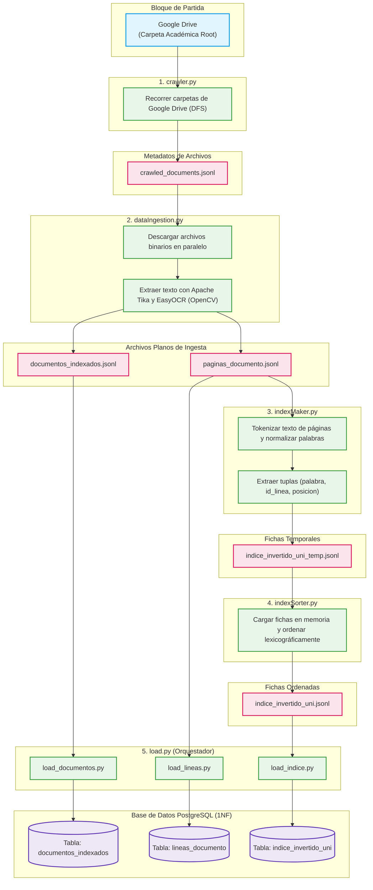
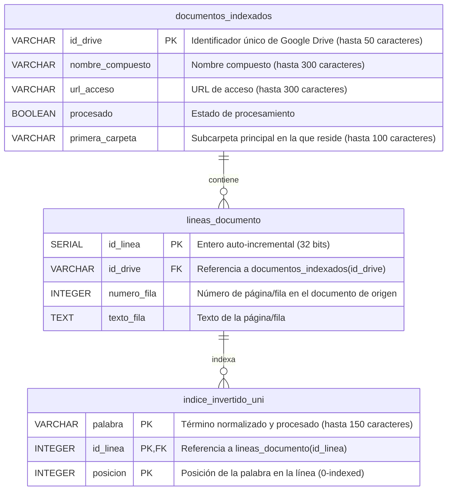

# DocUNI - Buscador Inteligente de Documentos

DocUNI es un motor de búsqueda rápido e inteligente diseñado para buscar e indexar documentos académicos (planchas, sistemas, etc.). Utiliza un índice inverso posicional almacenado en una base de datos PostgreSQL en Primera Forma Normal (1NF) y emplea el sofisticado algoritmo **Okapi BM25** con optimizaciones de proximidad para garantizar que los resultados más relevantes se presenten primero.

---

## 0. Cómo inicializar el proyecto y probarlo

El proyecto está dockerizado para facilitar su ejecución y despliegue sin depender de configuraciones locales complejas.

### Requisitos previos:
- Tener instalado **Docker** y **Docker Compose**.
- Tener los puertos `5000` (Web) y `5432` (PostgreSQL) disponibles en tu máquina.

### Pasos para ejecutar:
1. Asegúrate de tener los archivos CSV generados por el proceso batch. Estos documentos se encuentran dentro de "https://drive.google.com/drive/folders/1Z1pa3MrlHYy0LpVogrYO8N58bN2YRFaC?usp=drive_link". 

**Nota**: Estos son utilizados por el script de inicialización `docker-init-data.sql` para poblar la base de datos de manera súper rápida usando el comando `COPY`. Coloca la descompresión del `DATA.zip` en la raíz del proyecto. Coloca `Tablas-temporales.zip` dentro de la carpeta `proceso_batch/archivos_planos`.

2. Abre una terminal en la raíz del proyecto.
3. Ejecuta el siguiente comando para construir las imágenes y levantar los contenedores:
   ```bash
   docker compose up --build
   ```
4. El proceso iniciará dos contenedores:
   - `docuni-db`: Base de datos PostgreSQL. En su primera ejecución creará las tablas necesarias (desde `CREATE_SQL.sql`) y cargará la data.
   - `docuni-web`: Aplicación backend en Flask.
5. Una vez que ambos contenedores estén listos, abre tu navegador web y dirígete a:
   [http://localhost:5000](http://localhost:5000)
6. Ingresa palabras clave en la barra de búsqueda y explora los resultados.

*Nota: Si alguna vez necesitas reiniciar la base de datos y borrar los datos persistidos (por ejemplo, si cambias la estructura de las tablas), puedes ejecutar `docker compose down -v` para eliminar el volumen de persistencia antes de volver a levantar los servicios.*

---

## 1. Flujo de Ingesta y Procesamiento Batch (Pipeline ETL)

El índice inverso es el "corazón" del motor de búsqueda. Se genera a través de un flujo de procesamiento por lotes (*batch*) dividido en 5 scripts de Python ejecutados secuencialmente.

### 1.1. Diagrama del Proceso Batch



### 1.2. Secuencia de Scripts Batch

1. **`crawler.py`**
   - **¿Qué hace?**: Recorre recursivamente (búsqueda en profundidad - DFS) la estructura de directorios en Google Drive mediante su API para detectar archivos académicos.
   - **Formato de entrada**: Consulta remota a la API de Google Drive v3.
   - **Formato de salida**: Archivo plano `crawled_documents.jsonl` en la carpeta `proceso_batch/archivos_planos/` con el ID de Drive, nombre original, carpetas padre y URLs de acceso de cada archivo encontrado.

2. **`dataIngestion.py`**
   - **¿Qué hace?**: Descarga en paralelo (utilizando múltiples hilos) los recursos binarios listados en `crawled_documents.jsonl`. Realiza la extracción híbrida de texto: usa Apache Tika para formatos de texto nativo (PDF digitales, DOCX, TXT) y un pipeline óptico con OpenCV y EasyOCR para procesar mapas de bits e imágenes procedentes de PDF escaneados.
   - **Formato de entrada**: Archivo `crawled_documents.jsonl` y descarga de datos desde Google Drive API.
   - **Formato de salida**: 
     - `documentos_indexados.jsonl`: metadatos de los archivos descargados.
     - `paginas_documento.jsonl`: texto completo segmentado línea por línea (por página) identificada con un identificador secuencial.

3. **`indexMaker.py`**
   - **¿Qué hace?**: Lee las páginas indexadas desde `paginas_documento.jsonl`, limpia y tokeniza el contenido. Aplica normalización avanzada en español (remoción de acentos, tildes, paso a minúsculas, filtrado de símbolos, eliminación de plurales al quitar la `s` final en palabras de más de 3 caracteres y corrección de errores típicos de OCR). Genera las tuplas posicionales `(palabra, id_linea, posicion)`.
   - **Formato de entrada**: `paginas_documento.jsonl`.
   - **Formato de salida**: Archivo temporal `indice_invertido_uni_temp.jsonl` conteniendo las fichas posicionales desordenadas de cada token.

4. **`indexSorter.py`**
   - **¿Qué hace?**: Lee el archivo temporal de fichas, las carga en memoria y las ordena lexicográficamente por término (y numéricamente por `id_linea` y `posicion`). Este paso optimiza drásticamente el proceso de inserción masiva a PostgreSQL.
   - **Formato de entrada**: `indice_invertido_uni_temp.jsonl`.
   - **Formato de salida**: Archivo plano final `indice_invertido_uni.jsonl` listo para importarse.

5. **`load.py`**
   - **¿Qué hace?**: Es el script orquestador de la fase de carga (Load). Llama secuencialmente a tres scripts especializados para importar la data de manera eficiente utilizando Bulk Inserts (`execute_values` de `psycopg2`) y controlando conflictos mediante sentencias `ON CONFLICT DO NOTHING`:
     - `load_documentos.py`: Lee `documentos_indexados.jsonl` y puebla la tabla `documentos_indexados`.
     - `load_lineas.py`: Lee `paginas_documento.jsonl` y puebla la tabla `lineas_documento`.
     - `load_indice.py`: Lee `indice_invertido_uni.jsonl` y puebla el índice inverso atómico `indice_invertido_uni`.
   - **Formato de entrada**: Archivos planos `.jsonl` resultantes de las fases anteriores.
   - **Formato de salida**: Tablas pobladas e indexadas en PostgreSQL.

---

### 1.3. Extracción e Ingesta Híbrida (Tika vs OCR)

El pipeline de ingesta implementa un enrutamiento inteligente basado en el tipo MIME de los archivos descargados:

```
                  [ Descarga desde Google Drive API ]
                                  │
                    ────── Evaluador MIME ──────
                   │                            │
         [ Archivo Texto Nativo ]       [ Imagen / PDF Escaneado ]
                   │                            │
           ( Apache Tika )               ( Módulo OCR Local )
                   │                     ├─ OpenCV: Filtros & Limpieza
                   │                     └─ EasyOCR: Inferencia Neuronal
                   │                            │
                   └─────► [ Unificación ] ◄────┘
                                  │
                      ( Inserción en lineas_documento )
                                  │
                      ( Tokenización & Posicionamiento )
                                  │
                     ( Bulk Insert en indice_invertido_uni )
```

#### Ruta A (Documentos Digitales Nativos)
Si el archivo es un PDF con capa de texto, DOCX o TXT, `Apache Tika` parsea el buffer y extrae el texto respetando los saltos de página XML nativos.

#### Ruta B (Imágenes y Documentos Escaneados)
Si el archivo es una imagen (`.png`, `.jpg`, `.jpeg`) o un PDF sin capa de texto legible, se activa el submódulo óptico local:
- **Conversión de PDF a imágenes**: `pdf2image` renderiza cada página del documento en un mapa de bits independiente en memoria.
- **Preprocesamiento Óptico (OpenCV)**: Cada imagen se convierte a escala de grises y se le aplica un desenfoque mediano (`medianBlur`) para reducir el ruido visual y optimizar los bordes antes de la detección:
  ```python
  import cv2
  import numpy as np

  def preprocesar_imagen(imagen_bytes):
      # Convertir el buffer de bytes a una matriz OpenCV
      nparr = np.frombuffer(imagen_bytes, np.uint8)
      img = cv2.imdecode(nparr, cv2.IMREAD_GRAYSCALE)
      # Reducción de ruido mediante filtro de mediana
      img_limpia = cv2.medianBlur(img, 3)
      return img_limpia
  ```
- **Inferencia Neuronal (EasyOCR)**: La imagen limpia es procesada por el motor de EasyOCR configurado para español. El objeto `Reader` se inicializa de manera global una sola vez para optimizar tiempos:
  ```python
  import easyocr

  # Instanciación única global
  reader = easyocr.Reader(['es'], gpu=False)

  def extraer_texto_ocr(imagen_procesada):
      # Extracción directa del texto crudo consolidado
      lineas_texto = reader.readtext(imagen_procesada, detail=0)
      return "\n".join(lineas_texto)
  ```

Tras obtener el texto mediante cualquiera de las rutas, cada página o fragmento se registra en la base de datos en la tabla `lineas_documento`:
```sql
INSERT INTO lineas_documento (id_drive, numero_fila, texto_fila) 
VALUES (%s, %s, %s) RETURNING id_linea;
```

---

### 1.4. Tokenización y Mapeo Posicional

Para cada fila o página indexada con un `id_linea`:
1. El texto se normaliza (remoción de tildes, paso a minúsculas, caracteres especiales y eliminación de plurales al quitar la `s` final en palabras de longitud mayor a 3).
2. El texto normalizado se divide por espacios en un vector ordenado de palabras (`tokens`).
3. Se itera secuencialmente sobre el vector para generar los registros posicionales que determinan el orden físico exacto de aparición del término en el fragmento: `("termino1", id_linea, 0)`, `("termino2", id_linea, 1)`, etc.

---

### 1.5. Inserción Masiva por Lotes (Bulk Insert)

Dado que modelar el índice a nivel posicional y atómico genera millones de filas, realizar inserciones individuales degradaría el rendimiento de PostgreSQL. Se utiliza la inserción masiva por lotes (Bulk Insert) a través de `execute_values` de `psycopg2` y control de colisión por clave primaria compuesta:

```python
import psycopg2
from psycopg2.extras import execute_values

def guardar_lote_indice(cursor, lote_tuplas_atomicas):
    query_insert = """
        INSERT INTO indice_invertido_uni (palabra, id_linea, posicion) 
        VALUES %s 
        ON CONFLICT (palabra, id_linea, posicion) DO NOTHING
    """
    execute_values(cursor, query_insert, lote_tuplas_atomicas)
```

---

## 2. Algoritmo de Búsqueda y Extracción (Information Retrieval en Read-Time)

Al delegar los cálculos al momento de la lectura (Read-Time Computation), el motor se mantiene reactivo ante cambios rápidos en el corpus.

### 2.1. Recuperación y Cálculo de Frecuencia (TF) Local al Vuelo

Cuando se busca una sola palabra, el motor extrae de forma instantánea su frecuencia local (`tf`) agrupando por `id_linea` y guardando la lista de posiciones físicas:

```sql
SELECT 
    id_linea, 
    COUNT(*) AS frecuencia, 
    ARRAY_AGG(posicion ORDER BY posicion) AS lista_posiciones 
FROM indice_invertido_uni 
WHERE palabra = 'sistemas' 
GROUP BY id_linea;
```

### 2.2. Búsqueda Multi-palabra No Estricta (OR)

Para consultas complejas con múltiples palabras, se remueve el comportamiento estrictamente conjuntivo (AND) y se recuperan de forma agregada todas las líneas que posean al menos uno de los términos buscados. La base de datos agrupa y devuelve las posiciones asociadas de forma compacta en JSONB:

```sql
SELECT 
    i.id_linea,
    l.id_drive,
    l.numero_fila AS numero_linea,
    l.texto_fila AS texto_linea,
    d.nombre_compuesto,
    d.url_acceso,
    COUNT(r.posicion) AS frecuencia_total,
    jsonb_object_agg(i.palabra, i.posiciones) AS posiciones_por_palabra
FROM (
    SELECT 
        id_linea, 
        palabra, 
        array_agg(posicion ORDER BY posicion) AS posiciones
    FROM indice_invertido_uni
    WHERE palabra = ANY(%s)
    GROUP BY id_linea, palabra
) i
JOIN indice_invertido_uni r ON r.id_linea = i.id_linea AND r.palabra = i.palabra
JOIN lineas_documento l ON i.id_linea = l.id_linea
JOIN documentos_indexados d ON l.id_drive = d.id_drive
GROUP BY i.id_linea, l.id_drive, l.numero_fila, l.texto_fila, d.nombre_compuesto, d.url_acceso
```

---

## 3. Algoritmo de Ranking y Generación de Resultados

### 3.1. Puntuación Matemática Okapi BM25

El motor calcula la relevancia estadística de cada fragmento (línea) para la consulta $Q$ (que consta de palabras clave $q_1, q_2, \dots, q_n$) utilizando la fórmula probabilística Okapi BM25:

$$\text{Score}_{\text{BM25}}(D, Q) = \sum_{i=1}^{n} \text{IDF}(q_i) \cdot \frac{f(q_i, D) \cdot (k_1 + 1)}{f(q_i, D) + k_1 \cdot \left(1 - b + b \cdot \frac{|D|}{\text{avgdl}}\right)}$$

$$\text{IDF}(q_i) = \ln \left( \frac{N - n(q_i) + 0.5}{n(q_i) + 0.5} + 1 \right)$$

#### - Desglose de Parámetros en el Código (`aplicativo/app.py`):

| Símbolo Matemático | Variable en Código | Tipo/Valor | Descripción |
| :---: | :---: | :---: | :--- |
| $N$ | `N` | Dinámico (Float) | Número total de líneas/páginas indexadas (`lineas_documento`). |
| $n(q_i)$ | `df` | Dinámico (Int) | Cantidad de líneas únicas que contienen la palabra clave $q_i$. |
| $\text{avgdl}$ | `avgdl` | Dinámico (Float) | Longitud promedio (cantidad de palabras) de todas las líneas en el corpus. |
| $|D|$ | `doc_len` | Dinámico (Int) | Cantidad de palabras en la línea actual. |
| $f(q_i, D)$ | `tf` | Dinámico (Int) | Frecuencia de la palabra $q_i$ en la línea de texto evaluada. |
| $k_1$ | `k1` | **$1.2$** | Factor de saturación del término frecuencia. |
| $b$ | `b` | **$0.75$** | Factor de penalización por la longitud de la línea. |

---

### 3.2. Optimización por Proximidad y Frase Exacta

El motor evalúa las diferencias en las posiciones físicas entre los términos de búsqueda que sí coincidieron en el fragmento.
Si dos o más términos de la consulta aparecen en la misma línea, se calcula el menor "span" o ventana de la frase:
$$\text{span} = \max(\text{posiciones}) - \min(\text{posiciones})$$
La distancia absoluta adicional es:
$$\text{distancia} = \text{span} - (k - 1)$$
Donde $k$ es el número de términos buscados presentes. Si la distancia es corta ($\le 3$), se inyecta un bono multiplicador al score total de BM25:
- **Distancia = 0 (Adyacentes)** ➔ Bono de 2.0x (100% de aumento).
- **Distancia = 1** ➔ Bono de 1.5x (50% de aumento).
- **Distancia = 2** ➔ Bono de 1.33x (33% de aumento).
- **Distancia = 3** ➔ Bono de 1.25x (25% de aumento).
- **Distancia > 3** o menos de 2 términos presentes ➔ Sin bono (1.0x).

Esto eleva la relevancia de oraciones coherentes y frases exactas por encima de las apariciones aisladas.

---

### 3.3. Extracción Dinámica de Snippets (KWIC - Key Word In Context)

Con las 10 líneas de mayor puntuación ordenadas descendentemente:
1. **Punto de anclaje**: Localiza la primera coincidencia del término de consulta en el texto.
2. **Recorte de ventana**: Recorta y recupera un sub-fragmento del texto que cubre hasta 8 palabras antes de la primera coincidencia y hasta 8 palabras después de la última coincidencia.
3. **Resaltado**: Envuelve las palabras consultadas en etiquetas semánticas HTML `<b>palabra</b>`.

---

### 3.4. Ensamblaje de Enlaces de Acceso Profundo (Deep Links)

Realiza un `JOIN` entre `lineas_documento` y `documentos_indexados` a través de `id_drive`.
El enlace final se construye concatenando el visor web de Drive con el parámetro hash de la línea correspondiente:
$$\text{Deep Link} = \text{url\_acceso} + \text{"\#line="} + \text{numero\_linea}$$
Si el archivo original es una imagen indexada mediante OCR, el enlace redirige de manera predeterminada a la página 1.

---

## 4. Estructura del Aplicativo

El aplicativo web de DocUNI consta de tres partes principales interactuando en tiempo real:

- **Backend (Python + Flask)**:
  - **`aplicativo/app.py`**: Recibe las consultas del cliente, limpia y tokeniza términos, consulta la base de datos PostgreSQL, aplica las fórmulas matemáticas de BM25 y cálculo de proximidad, y pagina el JSON de respuesta.
  - **`db_config.py`**: Configuración de conexión mediante `psycopg2`.

- **Frontend (Vanilla Web)**:
  - **`aplicativo/templates/index.html`**: Layout responsivo y elegante con estética premium *glassmorphism*.
  - **`aplicativo/static/css/style.css`**: Hoja de estilos pura en CSS oscuro con animaciones y efectos dinámicos.
  - **`aplicativo/static/js/main.js`**: Manejador del cliente que realiza peticiones asíncronas (`fetch`) y actualiza dinámicamente el listado de resultados e indicadores de estado.

---

## 5. Modelo y Diseño de la Base de Datos (1NF Schema)

Para la máxima eficiencia, las tablas se modelan de manera atómica relacional pura.

### 5.1. Relación de Datos (ERD Lógico)



---

### 5.2. Diccionario de Datos

#### - Tabla: `documentos_indexados`
Registra la información del catálogo de documentos académicos.

| Campo | Tipo | Restricción | Descripción / Propósito |
| :--- | :--- | :--- | :--- |
| **`id_drive`** | `VARCHAR(50)` | `PRIMARY KEY` | Identificador de Google Drive único por archivo. |
| **`nombre_compuesto`** | `VARCHAR(300)` | `NOT NULL` | Ruta lógica y nombre del material. |
| **`url_acceso`** | `VARCHAR(300)` | `NOT NULL` | Dirección de vista previa en Google Drive. |
| **`procesado`** | `BOOLEAN` | `NOT NULL DEFAULT FALSE` | Estado que confirma si el archivo ya fue procesado por el batch. |
| **`primera_carpeta`** | `VARCHAR(100)` | - | Nombre de la primera subcarpeta contenedora. |

---

#### - Tabla: `lineas_documento`
Almacena el texto fragmentado a nivel de fila o página (Forward Index).

| Campo | Tipo | Restricción | Descripción / Propósito |
| :--- | :--- | :--- | :--- |
| **`id_linea`** | `SERIAL` | `PRIMARY KEY` | Identificador único autoincremental de la línea de texto. |
| **`id_drive`** | `VARCHAR(50)` | `REFERENCES documentos_indexados` | Clave foránea al documento de origen. |
| **`numero_fila`** | `INTEGER` | `NOT NULL` | Número de página real o fila en el archivo original. |
| **`texto_fila`** | `TEXT` | `NOT NULL` | Texto extraído original de la página. |

*Restricción UNIQUE*: `(id_drive, numero_fila)` evita el registro duplicado de filas para un mismo archivo.

---

#### - Tabla: `indice_invertido_uni`
Mapea de forma posicional atómica cada token con la línea de origen (Índice Inverso).

| Campo | Tipo | Restricción | Descripción / Propósito |
| :--- | :--- | :--- | :--- |
| **`palabra`** | `VARCHAR(150)` | `PRIMARY KEY (1/3)` | Término normalizado y procesado. |
| **`id_linea`** | `INTEGER` | `PRIMARY KEY (2/3), REFERENCES lineas_documento` | Clave foránea a la línea de origen. |
| **`posicion`** | `INTEGER` | `PRIMARY KEY (3/3)` | Índice de la posición del token en la línea (0-indexed). |

*Llave Primaria Compuesta*: `(palabra, id_linea, posicion)` garantiza la consistencia e integridad relacional.

---

### 5.3. Índices de Rendimiento y Optimización
1. **`idx_palabra_busqueda` (B-Tree sobre `palabra` en `indice_invertido_uni`)**: Optimiza búsquedas e intersecciones de términos, logrando respuestas en $O(\log n)$ milisegundos.
2. **`idx_paginas_drive` (B-Tree sobre `id_drive` en `lineas_documento`)**: Acelera las consultas por documento y reconstrucción del Forward Index.
