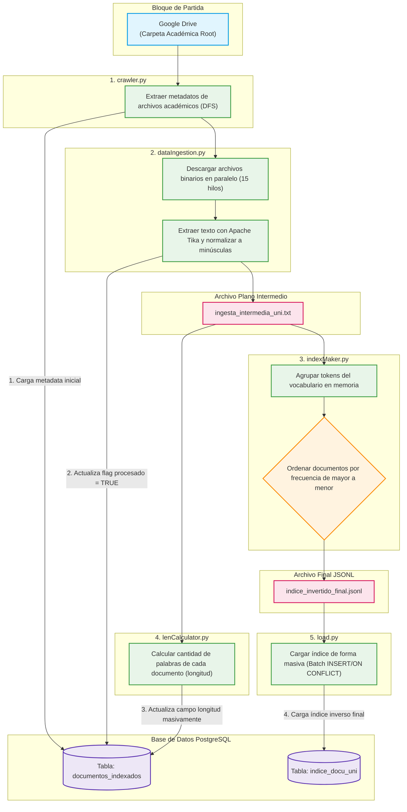
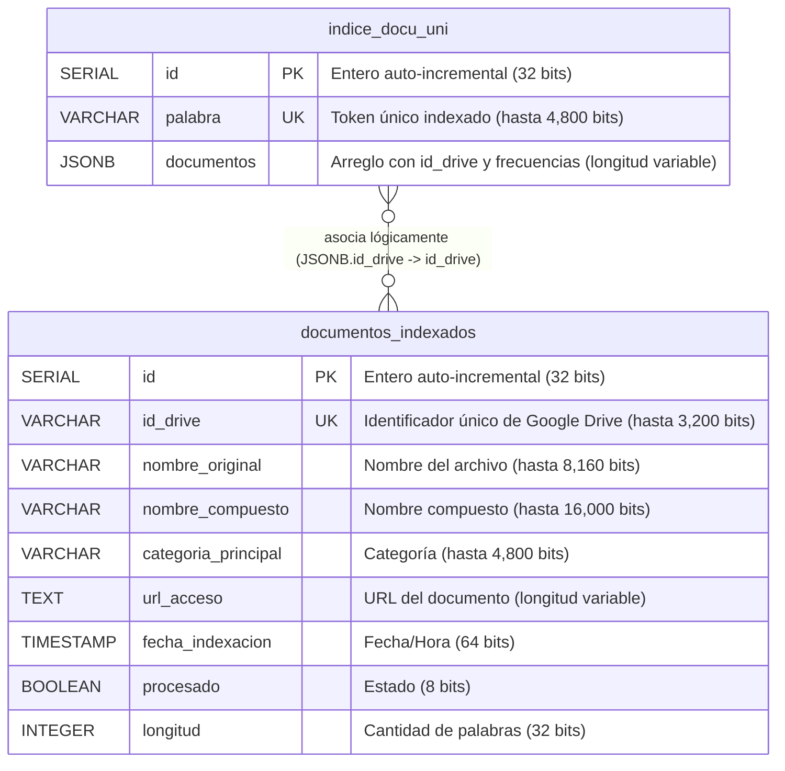

# DocUNI - Buscador Inteligente de Documentos

DocUNI es un motor de búsqueda rápido e inteligente diseñado para buscar e indexar documentos académicos (planchas, sistemas, etc.). Utiliza un índice inverso almacenado en una base de datos PostgreSQL y emplea el sofisticado algoritmo **Okapi BM25** para garantizar que los resultados más relevantes se presenten primero.

---

## 0. Cómo inicializar el proyecto y probarlo

El proyecto está dockerizado para facilitar su ejecución y despliegue sin depender de configuraciones locales complejas.

### Requisitos previos:
- Tener instalado **Docker** y **Docker Compose**.
- Tener los puertos `5000` (Web) y `5432` (PostgreSQL) disponibles en tu máquina.

### Pasos para ejecutar:
1. Asegúrate de tener los archivos CSV generados por el proceso batch. Estos documentos se encuentran dentro de "https://drive.google.com/drive/folders/1Z1pa3MrlHYy0LpVogrYO8N58bN2YRFaC?usp=drive_link". 

**Nota**: Estos son utilizados por el script de inicialización `docker-init-data.sql` para poblar la base de datos de manera súper rápida usando el comando `COPY`. Colocar la descrompreción del `DATA.zip` raiz en la misma raiz del proyecto. Colocar `Tablas-temporales.zip` dentro de la carpeta `proceso_batch/archivos_planos`.

2. Abre una terminal en la raíz del proyecto.
3. Ejecuta el siguiente comando para construir las imágenes y levantar los contenedores:
   ```bash
   docker compose up --build
   ```
4. El proceso iniciará dos contenedores:
   - `docuni-db`: Base de datos PostgreSQL. En su primera ejecución creará las tablas necesarias (desde `CREATE_SQL.sql`) y cargará la data.
   - `docuni-web`: Aplicación backend en Flask.
5. Una vez que ambos contenedores estén listos, abre tu navegador web y dirígete a:
   [http://localhost:5000](http://localhost:5000)
6. Ingresa palabras clave en la barra de búsqueda y explora los resultados.

*Nota: Si alguna vez necesitas reiniciar la base de datos y borrar los datos persistidos (por ejemplo, si cambias la estructura de las tablas), puedes ejecutar `docker compose down -v` para eliminar el volumen de persistencia antes de volver a levantar los servicios.*

---

## 1. Secuencia del Proceso Batch (Generación del Índice Inverso)

El índice inverso es el "corazón" del motor de búsqueda. Se genera a través de un flujo de procesamiento por lotes (*batch*) dividido en 5 scripts principales ejecutados en secuencia.

### Diagrama del Proceso Batch



### 1. `crawler.py`
- **¿Qué hace?**: Se encarga de navegar o conectarse a los orígenes de datos (como Google Drive u otros repositorios) para extraer los documentos crudos y/o su metadata (nombre original, categoría, URLs de acceso).
- **Formato de entrada**: APIs externas o sistema de archivos.
- **Formato de salida**: Sube la data a la base de datos en la tabla de "documentos_indexados".
  - *Ejemplo de metadata insertada*:
    ```json
    {
      "id_drive": "1A2B3C4D5E",
      "nombre_original": "examen_parcial_2023.pdf",
      "categoria_principal": "Sistemas Operativos"
    }
    ```

### 2. `dataIngestion.py`
- **¿Qué hace?**: Procesa los datos crudos extraídos por el crawler. Extrae el texto, lo convierte a minúsculas, elimina puntuación/caracteres especiales mediante expresiones regulares, y separa el contenido en palabras válidas.
- **Formato de entrada**: Con las direcciones obtenidas del crawler, el sistema utiliza la api de Google Drive para descargar los datos. Utiliza: id_drive.
- **Formato de salida**: Un archivo plano intermedio (ej. `ingesta_intermedia_uni.txt`) que contiene listas de palabras mapeadas a los documentos. Formato: "{id_drive} | {palabras}"
  - *Ejemplo de línea generada*:
    `1A2B3C4D5E | examen parcial sistemas operativos resolucion...`

### 3. `indexMaker.py`
- **¿Qué hace?**: Toma el archivo de ingesta y construye propiamente el **índice inverso**. Agrupa todas las palabras únicas del vocabulario y asocia cada una a la lista de documentos (`id_drive`) donde aparece, sumando también la frecuencia (cantidad de veces que aparece en ese documento).
- **Formato de entrada**: `ingesta_intermedia_uni.txt`.
- **Formato de salida**: Un archivo temporal JSON (como `indice_docu_uni.json`) o estructuras en memoria preparadas para exportación.
  - *Ejemplo de estructura generada*:
    ```json
    {
      "palabra": "sistemas",
      "documentos": [
        {"id_drive": "1A2B3C4D5E", "frecuencia": 5},
        {"id_drive": "9Z8Y7X6W5V", "frecuencia": 2}
      ]
    }
    ```

### 4. `lenCalculator.py`
- **¿Qué hace?**: Recorre la data procesada para calcular la **longitud total** (cantidad total de palabras) de cada documento. Este cálculo es estrictamente necesario para poder aplicar la penalización de longitud del algoritmo BM25 más adelante.
- **Formato de entrada**: Archivo de ingesta intermedio o JSONs temporales.
- **Formato de salida**: Archivos o estructuras donde la metadata del documento se actualiza añadiendo el campo `longitud` a los datos de la tabla "documentos_indexados".
  - *Ejemplo de actualización*:
    Tras contar las palabras de la línea en `ingesta_intermedia_uni.txt`, se determina que el documento `1A2B3C4D5E` tiene `350` palabras. El campo `longitud` se actualiza a `350`.

### 5. `load.py`
- **¿Qué hace?**: Actúa como el exportador final. Convierte las estructuras procesadas (documentos indexados con sus longitudes, y el índice inverso JSON) en archivos delimitados listos para ser importados a la base de datos a alta velocidad.
- **Formato de entrada**: Estructuras en memoria o archivos JSON de los pasos 3 y 4.
- **Formato de salida**: Archivos **`.csv`** que se ubican en las carpetas `documentos_data` e `indice_docu_data`, preparados para ser leídos por PostgreSQL vía `COPY`.
  - *Ejemplo de fila en `indice_docu_data/data.csv`*:
    `sistemas,"[{""id_drive"": ""1A2B3C4D5E"", ""frecuencia"": 5}, {""id_drive"": ""9Z8Y7X6W5V"", ""frecuencia"": 2}]"`

---

## 2. El algoritmo de Ordenamiento: Okapi BM25

Para entregar los mejores resultados, DocUNI no se basa solo en un recuento simple de palabras, sino que implementa **Okapi BM25** (Best Matching 25), un estándar de la industria en motores de búsqueda modernos.

### ¿Cómo funciona?
BM25 califica la relevancia de un documento frente a una consulta (*query*) basándose en tres componentes fundamentales:

1. **Frecuencia del término (TF - Term Frequency)**: Recompensa a los documentos donde la palabra buscada aparece muchas veces. Sin embargo, aplica una *saturación*: si una palabra aparece 50 veces, no es 50 veces más relevante que si aparece 1 vez, el crecimiento del valor se aplana gradualmente (controlado por la constante $k_1$).
2. **Frecuencia Inversa de Documento (IDF)**: Penaliza las palabras comunes y recompensa las palabras raras. Si buscas "sistemas distribuidos", la palabra "sistemas" probablemente aparezca en muchos documentos, aportando poco valor discriminativo. "Distribuidos" será más rara, por ende, el algoritmo le otorgará un peso (IDF) mucho mayor en el puntaje final.
3. **Normalización por Longitud del Documento**: Si un documento es enorme (un libro de 500 páginas), es natural que contenga muchas veces tus palabras de búsqueda. Si un documento corto (1 página) contiene tus palabras la misma cantidad de veces, el documento corto es mucho más relevante. BM25 penaliza los documentos que son más largos que el promedio general de la colección (controlado por la constante $b$).

### Fórmulas Matemáticas y Parámetros del Código

El algoritmo calcula el score de relevancia de cada documento $D$ para una consulta $Q$ (con palabras clave $q_1, q_2, \dots, q_n$) de la siguiente forma:

#### 1. Fórmula General del Score BM25

$$\text{Score}_{\text{BM25}}(D, Q) = \sum_{i=1}^{n} \text{IDF}(q_i) \cdot \frac{f(q_i, D) \cdot (k_1 + 1)}{f(q_i, D) + k_1 \cdot \left(1 - b + b \cdot \frac{|D|}{\text{avgdl}}\right)}$$

#### 2. Fórmula de la Frecuencia Inversa de Documento (IDF)

$$\text{IDF}(q_i) = \ln \left( \frac{N - n(q_i) + 0.5}{n(q_i) + 0.5} + 1 \right)$$

---

#### - Desglose Visual y Equivalencias en el Código

A continuación se detalla cada componente de la fórmula y cómo está mapeado en el backend (`aplicativo/app.py`):

| Símbolo Matemático | Variable en Código | Tipo/Valor | Descripción |
| :---: | :---: | :---: | :--- |
| $N$ | `N` | Dinámico (Float) | Número total de documentos indexados y procesados (`procesado = TRUE`). |
| $n(q_i)$ | `n_qi` | Dinámico (Int) | Cantidad de documentos que contienen la palabra clave $q_i$. |
| $\text{avgdl}$ | `avgdl` | Dinámico (Float) | Longitud promedio (cantidad de palabras) de todos los documentos. |
| $|D|$ | `doc_len` | Dinámico (Int) | Longitud del documento actual $D$. |
| $f(q_i, D)$ | `tf` | Dinámico (Int) | Frecuencia (apariciones) de la palabra $q_i$ en el documento $D$. |
| $k_1$ | `k1` | **$1.5$** | Factor de saturación del término frecuencia. |
| $b$ | `b` | **$0.75$** | Factor de penalización por longitud del documento. |

---

### Implementación en la aplicación
- En `app.py`, el sistema calcula dinámicamente el puntaje al vuelo.
- Se hace una "gran división" inicial: Los documentos que contienen **todas** las palabras de búsqueda se colocan en el Bloque A. Los que contienen solo **algunas**, en el Bloque B.
- Dentro de cada bloque, los documentos se ordenan de **mayor a menor usando su puntaje BM25**, garantizando resultados altamente precisos y relevantes en la cima de la página.

---

## 3. Estructura del Aplicativo

El backend y frontend de la aplicación web interactúan con la base de datos para ofrecer la experiencia de búsqueda al usuario final.

- **Backend (Python + Flask)**:
  - **`aplicativo/app.py`**: Es el núcleo de la aplicación. Expone una ruta estática para la interfaz (`/`) y una API RESTful en `/api/search`. Esta API recibe la consulta, hace limpieza de las palabras, consulta el índice inverso en PostgreSQL usando arrays, ejecuta las matemáticas del modelo BM25 y pagina los resultados en bloques de 10.
  - **`db_config.py`**: Contiene las credenciales y configuración extraída de variables de entorno (Docker) para conectarse a PostgreSQL mediante la librería `psycopg2`.

- **Frontend (Vanilla Web)**:
  - **`aplicativo/templates/index.html`**: Estructura principal de la interfaz visual. Incluye un diseño moderno y responsivo con estética "glassmorphism", implementando indicadores de estado (Loading, Vacío, Sin resultados).
  - **`aplicativo/static/css/style.css`**: Hoja de estilos en cascada pura con variables CSS, animaciones suaves, efectos de hover y una paleta de colores oscura, brindando un acabado "premium".
  - **`aplicativo/static/js/main.js`**: Controlador del lado del cliente. Escucha el formulario de búsqueda, se comunica asíncronamente con el endpoint `/api/search` usando `fetch`, maneja la paginación dinámica y construye dinámicamente el HTML de las tarjetas de resultados donde se exhiben los detalles, el puntaje BM25 y enlaces a Drive.

- **Base de Datos (PostgreSQL)**:
  - Consiste en dos tablas optimizadas y debidamente indexadas para dar soporte a búsquedas en milisegundos. Para ver el detalle técnico del diccionario de datos y diagramas, consulta la sección **[4. Modelo y Diseño de la Base de Datos](#4-modelo-y-diseño-de-la-base-de-datos)**.

---

## 4. Modelo y Diseño de la Base de Datos

Para una exposición o sustentación técnica, el diseño físico y lógico de la base de datos es clave. El sistema utiliza **PostgreSQL** y cuenta con dos tablas principales y un conjunto de índices optimizados.

### Relación de Datos (ERD Lógico)
A continuación se ilustra la relación entre las tablas mediante un diagrama de entidad-relación (ERD):



### Detalle Técnico de Tablas (Diccionario de Datos)

#### - Tabla: `documentos_indexados`
Esta tabla registra la información de catálogo, metadatos y longitudes de los documentos académicos.

| Campo (Nombre) | Tipo de Variable (PostgreSQL) | Longitud (en bits) | Descripción / Propósito |
| :--- | :--- | :--- | :--- |
| **`id`** | `SERIAL` (INTEGER) | **32 bits** (4 bytes) | Clave primaria autoincremental de la tabla. |
| **`id_drive`** | `VARCHAR(100)` | **Hasta 3,200 bits** *(1)* | Identificador único del archivo en Google Drive (Clave Única / Restricción `UNIQUE`). |
| **`nombre_original`** | `VARCHAR(255)` | **Hasta 8,160 bits** *(1)* | Nombre del archivo físico original tal como fue subido por el alumno. |
| **`nombre_compuesto`** | `VARCHAR(500)` | **Hasta 16,000 bits** *(1)* | Nombre normalizado o estructurado que facilita la identificación. |
| **`categoria_principal`** | `VARCHAR(150)` | **Hasta 4,800 bits** *(1)* | Especialidad o categoría académica principal (ej. *Sistemas Operativos*). |
| **`url_acceso`** | `TEXT` | **Variable** *(2)* | Dirección URL directa del recurso digital para visualizarlo o descargarlo. |
| **`fecha_indexacion`** | `TIMESTAMP` | **64 bits** (8 bytes) | Fecha y hora de inserción del registro (default: `CURRENT_TIMESTAMP`). |
| **`procesado`** | `BOOLEAN` | **8 bits** (1 byte físico) | Bandera que indica si el documento ya ha sido analizado e incorporado al índice. |
| **`longitud`** | `INTEGER` | **32 bits** (4 bytes) | Número de palabras totales del documento (crítico para penalización BM25). |

> *(1) Nota sobre VARCHAR:* PostgreSQL almacena `VARCHAR` usando codificación UTF-8. Un carácter puede consumir de 1 a 4 bytes (8 a 32 bits). En codificación básica ASCII, la longitud máxima es de 8 bits por carácter; el cálculo superior asume el peor escenario de 32 bits por carácter UTF-8.
> *(2) Nota sobre TEXT:* El tipo `TEXT` tiene una longitud variable que admite hasta 1 GB de información (~8.58 × 10⁹ bits) por registro.

---

#### 📋 Tabla: `indice_docu_uni`
Esta tabla representa el **Índice Inverso**, donde se asocia cada palabra con los documentos que la contienen.

| Campo (Nombre) | Tipo de Variable (PostgreSQL) | Longitud (en bits) | Descripción / Propósito |
| :--- | :--- | :--- | :--- |
| **`id`** | `SERIAL` (INTEGER) | **32 bits** (4 bytes) | Clave primaria autoincremental de la tabla. |
| **`palabra`** | `VARCHAR(150)` | **Hasta 4,800 bits** *(1)* | Token o palabra única indexada del vocabulario general (Clave Única / `UNIQUE`). |
| **`documentos`** | `JSONB` | **Variable** *(3)* | Estructura JSON binaria que almacena un arreglo con el `id_drive` y la frecuencia (`tf`) de la palabra en cada archivo. |

> *(3) Nota sobre JSONB:* El tipo de dato JSON binario almacena colecciones estructuradas optimizadas de forma física. Al igual que `TEXT`, su límite superior físico en PostgreSQL es de 1 GB (~8.58 × 10⁹ bits).

---

### Índices de Rendimiento y Optimización
Para lograr tiempos de respuesta en milisegundos durante las consultas del algoritmo BM25, se implementaron dos índices fundamentales:

1. **`idx_indice_palabra` (B-Tree sobre `palabra`)**:
   - Permite que la búsqueda exacta de un token en la tabla `indice_docu_uni` sea de complejidad temporal $O(\log n)$, localizando el registro de manera casi instantánea.
2. **`idx_jsonb_documentos` (GIN - Generalized Inverted Index sobre `documentos`)**:
   - Un índice GIN está especialmente diseñado para colecciones y objetos compuestos como `JSONB`. Permite indexar las claves internas y elementos del JSON de forma que Postgres pueda resolver consultas de contención o filtrado directo sin hacer un escaneo completo de la tabla (*sequential scan*).

